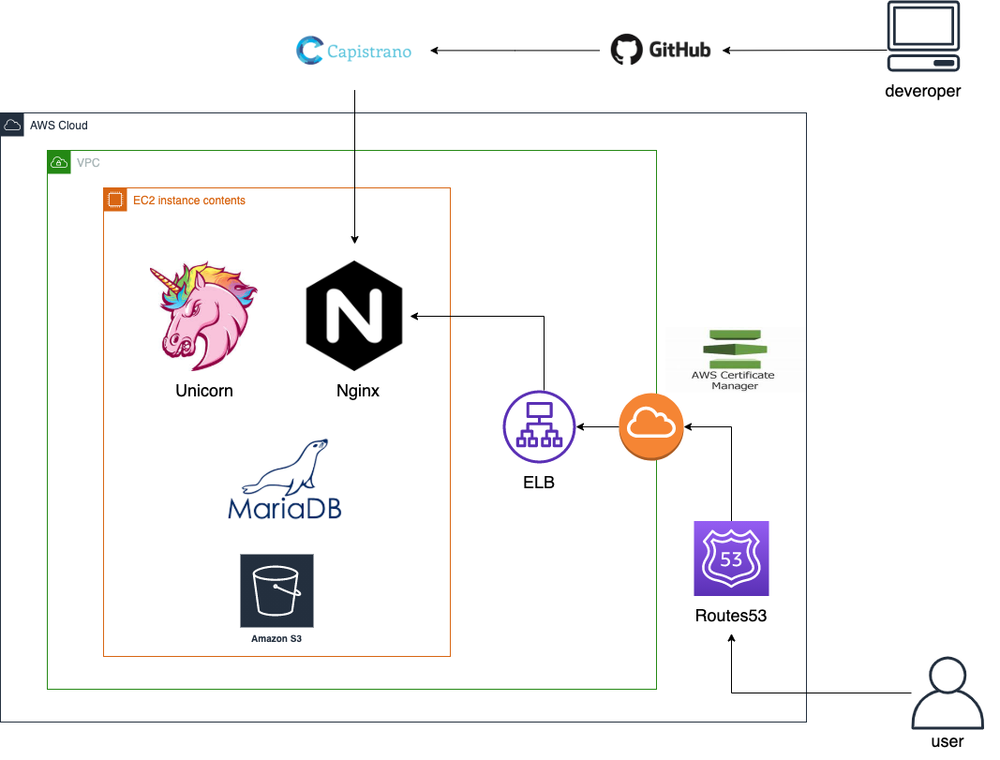
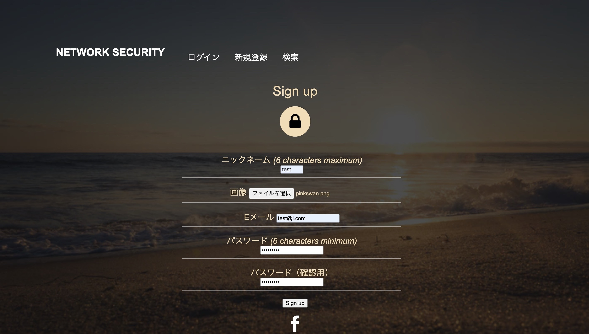
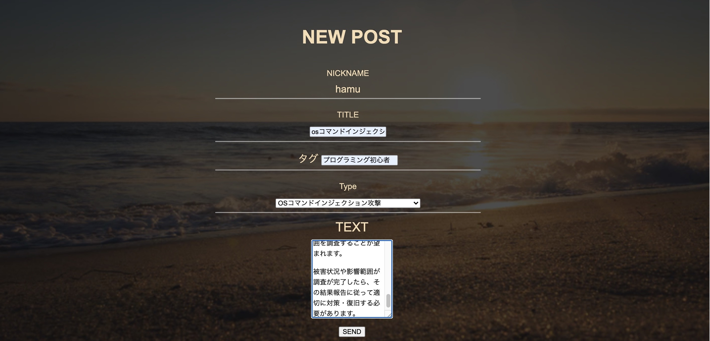

# README

#  :sparkles: アプリ名 :sparkles:

 NW_SECURITY 

# 概要

  WEBアプリケーション開発におけるセキュリティー問題解決ツールになります。ハッキングや不正アクセスを対処するための情報交換をすることができます。
  WEB検索では該当記事にヒットすることができなかった対処法を見つけ自身のアプリに導入することができます。またアウトプットの場としても有効です。

# 実装機能

  ## ユーザー管理機能
  - 新規登録
  - マイページ閲覧
  - いいねをした記事をマイページで閲覧
  - 編集
  - 削除

  ## 記事投稿機能
  - 新規投稿
  - 一覧表示
  - タグ付けによる関連性のある投稿が可能
  - 非同期にて記事にコメント
  - 編集
  - 削除

  ## 記事検索機能
  - 一覧表示
  - タグにて検索
  - カテゴリ別で検索

# 本番環境

  ## URL

  https://www.network-security-app.com/

  ## テストアカウント
  - ユーザー名 :  test
  - email      :  test@i.com
  - pass       :  test11

# 制作背景

  ITの普及により個人情報を守ることが必須になる現在、どんなに便利なアプリやサイトを作成してもユーザー目線に立った時、個人情報の流失の恐れがあるアプリやサイトを使いたいとは思いません。前職の金融機関でも個人情報の取り扱いについては厳しく指導を受けました。ITが大きく進歩している現在でもWEBサイトからの個人情報流出のニュースをよく目にします。そんな中私は、誰もが安心してアプリとサイトに登録し利用することができ、また制作者側も安心に使えるアプリやサイトを作れるように情報交換や、自身のアプリの安全性について調べることができるアプリを作成したいと思い、このアプリの作成に至った次第です。

# 工夫したポイント

  ## 非同期機能
  - いいねボタンが非同期にて行える
  - コメント機能が非同期で行える

  ## アプリケーションの外観
  - 直感的かつ、触って見たいと思ってもらえるようなアプリケーションにする。
  - トップページではスクロールをしなくても三つの機能に辿りつけること。

# 本番環境
  - AWSによる自動デプロイの実装。
  - S3による画像表示
  - git-secrets
  - EC2
  - AMI
  - Node.js
  - MariaDB
  - Unicorn
  - Route53
  - Certificate Manager
  - CCL化

# インフラ

## インフラ図

# 苦労したポイント

  ## 直感的なわかりやすさ
  一度見てわかる操作方法にするためボタンや文字にこだわりました。見た目のこだわりを残しつつ、直感的にわかる仕様にするのに苦労しました。

  ## 要件定義
  新しくオリジナルのアプリを作るにあたって、自分が作りたいアプリの概要をイメージし文字起こしするプロセスに苦労しました。自身の考えをまとめ全体をイメージし形にする経験をしたことで、全体像を俯瞰して見ることに強くなったと思っております。

# 追加したい機能

  ## コードスキャンをしAIによるセキュリティーチェック
  コードをこちらのアプリに貼ることでセキュリティーの安全性をパーセンテージで表示する機能を追加したいと考えております。この機能を実装することができれば、簡単にかつ短時間で自身のアプリの安全性を知ることができ、より強固なアプリやウェブサイトにすることができると考えます。

  ## ウェブ検索機能
  セキュリティに関連した記事をこちらのアプリから検索することができる機能を実装したいと考えております。google custom search APIを導入することで、検索から投稿、安全性の判定まで一貫してこちらのアプリで実行することができる、エンジニアに欠かせないアプリになると考えております。

# DEMO

## 新規登録
- 

## 投稿一覧表示画面

## 新規投稿ページ

## 投稿検索ページ

## 投稿詳細ページ

# 環境開発

  - Ruby
  - Rails
  - scss
  - HTML
  - JavaScript
  - React.js
  - JQuery
  - Ajax
  - Bootstrap
  - VSCode( Visual Studio Code )
  - MySQL

# DB設計

## users テーブル

  | Column            | Type   | Options       |
  | ----------------- | ------ | -----------   |
  | nickname          | string | null: false   |
  | email             | string | null: false   |
  | password          | string | null: false   |
  

  ### Association
  - has_many :posts
  - has_many :sns_credentials
  - has_many :comments
  - has_many :favorites
  - has_many :favorite_posts
  - has_one_attached :image
  

## posts テーブル
| Column            | Type     | Options                        |
| ----------------- | -------- | ------------------------------ |
| text              | text     | null: false                    |
| title             | text     | null: false                    |
| security_id       | integer  | null: false                    |
| user_id           | integer  | null: false                    |

   ### Association
   -  belongs_to_active_hash :security
   -  belongs_to :user
   -  has_many :post_tag_relations
   -  has_many :tags
   -  has_many :comments
   -  has_many :favorites
   -  has_one_attached :image

## tags テーブル

| Column        | Type       | Options                        |
| ------------- | ---------- | ------------------------------ |
| name           | string     | null: false                   |

### Association
 
 - has_many :post_tag_relations
 - has_many :posts

## favorites テーブル

| Column        | Type       | Options                        |
| ------------- | ---------- | ------------------------------ |
| user_id       | integer    | null: false                   |
| post_id       | integer     | null: false                   |

### Association
 
 - has_many :post_tag_relations
 - has_many :
 

  
## post_tag テーブル

| Column        | Type       | Options                        |
| ------------- | ---------- | ------------------------------ |
| post          | references |                                |
| tag           | references |                                |

### Association
 
 - belongs_to :post
 - belongs_to :tag

## sns_credentials テーブル

| Column        | Type       | Options                        |
| ------------- | ---------- | ------------------------------ |
| provider      | references |                                |
| uid           | references |                                |

### Association
 
 - belongs_to :user

## comments テーブル

| Column        | Type       | Options                        |
| ------------- | ---------- | ------------------------------ |
| user_id       |integer     |                                |
| post_id       | integer    |                                |
| text          | text       |                                |

### Association
 
 -  belongs_to :post  
 -  belongs_to :user 

## active_storage_blobs テーブル

| Column        | Type       | Options                        |
| ------------- | ---------- | ------------------------------ |
| key           |string      |   null: false                  |
| filename      | string     |   null: false                  |
| content_type  | string     |                                |
| metadata      | text       |                                |
| byte_size     | bigint     |    null: false                 |
| checksum      | string     |    null: false                |
| created_at    | datetime   |                                |
| :key          | index      |                                |

## active_storage_attachments テーブル

| Column        | Type       | Options                        |
| ------------- | ---------- | ------------------------------ |
| name          |string      |   null: false                  |
| filename      | string     |   null: false                  |
| content_type  | string     |                                |
| metadata      | text       |                                |
| byte_size     | bigint     |    null: false                 |
| checksum      | string     |    null: false                 |
| created_at    | datetime   |                                |
| :key          | index      |                                |

